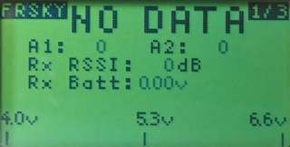
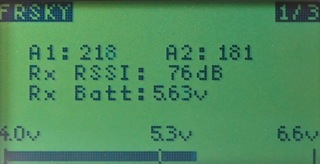
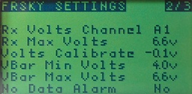
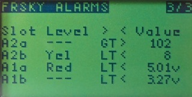

# This project has been superseded by [opentx](http://opentx.googlecode.com/) #

The following data is likely obsolete, kept here for mostly just for historical record.


# Fr-Sky Two-Way Telemetry Module Support #

The gruvin9x project was born mostly out of a desire to add support for [Fr-Sky](http://www.frsky-rc.com) telemetry data, including the ability to program the built-in [Fr-Sky](http://www.frsky-rc.com) alarm settings and utilise 'User Data' sent through the system for some purpose.

As of `trunk/` [r377](https://code.google.com/p/gruvin9x/source/detail?r=377), the above goals have been completed (excluding User Data).

Bearing in mind that one would not typically be looking at the '9X LCD screen while actually flying a plane, for example, following is how it looks, so far ...

## Screen Shots ##

### The Main FRSKY Page ###
After pressing `[DOWN (LONG)]`, one is presented with the **FRSKY 1/3** menu page.

> 

Here, we see the page with the Fr-Sky receiver powered off and thus no telemetry data being received. In this state, a large "NO DATA" message is displayed and the last known values, for A1, A2, RSSI, RX Batt and the graphical voltage bar, blink on and off to further accentuate the fact that data in this state is out of date.


And here is the same page with the Fr-Sky receiver powered on ...

> 

### FRSKY SETTINGS ###
Pressing `[RIGHT]` takes us to the **FRSKY SETTINGS 2/3 menu page.**

> 

Here we can set ...
  * which analog port (A1 or A2) is used for battery voltage (if any)
  * the maximum electrical voltage for the voltage adapter in use
  * a voltage calibration offset in 0.1V increments
  * the minimum and maximum voltages for the graphical voltage bar on page 1/3
  * whether or not we want an audible alarm when no telemetry data is being received

(I suppose that support for a second voltage display on the other available channel should be added. I'll wait to see how much interest there is, since the entire layout of this screen is bound to change anyway.)

### FRSKY ALARMS ###
Pressing `[RIGHT]` again takes us to the **FRSKY ALARMS 3/3 menu page.**

> 

Here we immediately see existing alarms values, as retrieved from the Fr-Sky transmitter module. (If for some reason you want to manually reload that data, you can press `[MENU (LONG)]`, while at the page/pages position, top right.)

Each of the four alarms as supported by the Fr-Sky transmitter module can be configured with a "Level" (of urgency), a mode -- greater than or less than -- and the value to which that mode applies. Each of the corresponding fields on this screen is editable. Select a field using `[UP]`, `[DOWN]`, `[LEFT]` and `[RIGHT]`. Press `[MENU]` to enter edit mode and make your selection using `[LEFT]` and `[RIGHT]`.

Pressing `[MENU]` again exits edit mode and it is at this point that the new alarm settings for that row are written out to the Fr-Sky transmitter module.

In case you're wondering, the 'GT' and 'LT' letters are '>' and '<' symbol memory aids, for those who may need same. **GT** stands for '<b>G</b>reater <b>T</b>han' and **LT** is for '<b>L</b>ess <b>T</b>han'.

Incidentally, the ordering of the alarm settings -- with A2 above A1 -- is intentional. For some reason, the Chinese designers ordered things in this way numerically, and it simply saves code and RAM space to not bother buffering and re-organising that fact for display. Even on the receiver casing, we see the input channels labelled 'backwards' (to the Western mind?) -- 'A2 A1', left to right. `*shrug*`

# TO DO #

  * Addition of graphical bar for signal strength

  * Allowance for two voltage bars, example: receiver batt. and main batt.

As at [r377](https://code.google.com/p/gruvin9x/source/detail?r=377), these TODOs have been postponed, pending user interest.

## Miscellaneous ##

The Fr-Sky Settings (page 2/3)are stored in local EEPROM. When I started developing this, there were two file types in use by the dynamic file storage system created by TH. These are, 'Type 1' -- for General Settings and 'Type 2' -- for Model data. I've now added a 'Type 3' -- for Fr-Sky settings.

> (As at [r377](https://code.google.com/p/gruvin9x/source/detail?r=377), EEPROM Fr-Sky Settings file format "3" has now been finalised. Changes to the format will include incrementing the the file's `myvers` field. So it should be safe to to write code for or record backups of EEPROM files including Fr-Sky settings as of [r377](https://code.google.com/p/gruvin9x/source/detail?r=377),as future code will try to be backward compatible and perform auto-format-upgrades where needed.)

Since my last update, I've also discovered TH's Ruby script, 'eeprom.rb'. The script analyses a binary dump file of the '9X EEPROM data and shows us the contents. (It's also for debugging data issues and converting data versions, I think.)

Here's what the output of eeprom.rb produces (having been upgraded to gruvin9x awareness) ...

```
   version     4 0x4 (Uint8_t)
    mySize    64 0x40 (Uint8_t)
  freeList    35 0x23 (Uint8_t)
        bs    16 0x10 (Uint8_t)

freeBlks=90 freeSz=1440
allocation map
////////////////r00 r01 r02 r03 c12 c13 b03 a00 a01 a02 a03 a04 
b04 r04 b05 b02 c03 b06 c04 c05 c06 c07 c08 c09 c10 c00 c01 c02 
b00 b01 s00  +1  +1  +1  +1  +1  +1  +1  +2 c11  +2 c14  +3 c15 
 +2  -1  +1  +1  +1  +1  +1  +1  +1  +1  +1  +1  +1  +1  +1  +1 
 +1  +1  +1  +1  +1  +1  +1  +1  +1  +1  +1  +1  +1  +1  +1  +1 
 +1  +1  +1  +1  +1  +1  +1  +1  +1  +1  +1  +1  +1  +1  +1  +1 
 +1  +1  +1  +1  +1  +1  +1  +1  +1  +1  +1  +1  +1  +1  +1  +1 
 +1  +1  +1  +1  +1  +1  +1  +1  +1  +1  +1  +1  +1  +1  +1 -127 

name sz typ sz2 Comments                   blocks
-------------------------------------------------
a    61  1   76 EEGeneral_r250             11, 12, 13, 14, 15,
b    99  2  619 ModelData_r250'GROOVY    ' 32, 33, 19, 10, 16, 18, 21,
c   238  2  619 ModelData_r250'TREX500   ' 29, 30, 31, 20, 22, 23, 24, 25, 26, 27,
d     0  2    0 
e     0  0    0 
f     0  0    0 
g     0  0    0 
h     0  0    0 
i     0  0    0 
j     0  0    0 
k     0  0    0 
l     0  0    0 
m     0  0    0 
n     0  0    0 
o     0  0    0 
p     0  0    0 
q     0  0    0 
r    61  1   76 EEGeneral_r250             4, 5, 6, 7, 17,
s     8  3    7 Freesky_r250               34,[Ver:1 Ch:A1 Vmax:6.6 Vofs:-0.10 BMin:4.0 BMax:6.6]
t     0  0    0 
```

**Even more impressive** is Erazz's `eePe` software, which I have not yet had time to teach about the new 'file type 3' for Fr-Sky settings. See [here](eePe.md) for more details.

