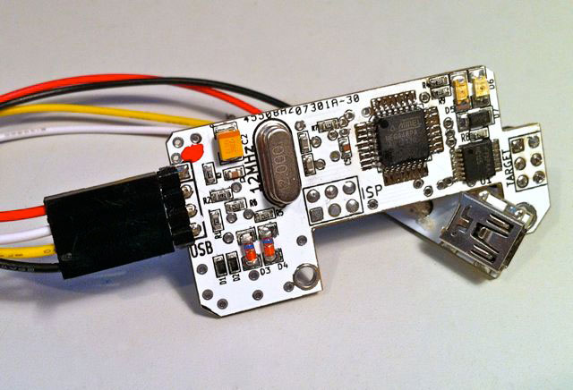
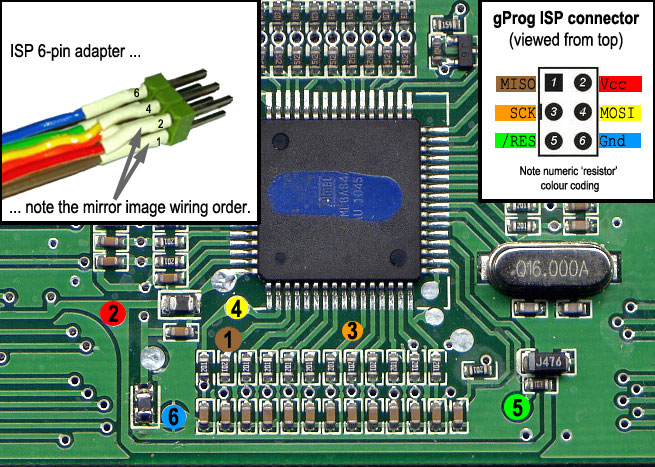
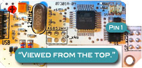

# G9X USBasp Compatible Programmer #
**gProg v1.2 Release** (now available from http://gruvin9x.com)

**gProg** is another freely published part of our open hardware project. It is based on the popular [USBasp open source project](http://www.fischl.de/usbasp/). This AVR programmer board is designed to be used with [companion9x](http://companion9x.googlecode.com) or any other AVRDUDE compatible system. With it, you can upload and download EEPROM stored model data as well as perform firmware upgrades. The device is especially designed to fit the [G9X v4.x custom controller board](PCB.md), but could also be used as a generic AVR flash programmer.

This board has a couple features compared to most USBasp programmers at the time of writing.

  1. A bug in the USBasp firmware preventing proper addressing of Flash memory on ATmega devices with more than 64Kbytes ROM has been fixed.

> 2. gProg has a switched buffer interface, enabling it to remain connected permanently to its host MCU without drawing power or otherwise interfering with the MISO/MOSI/CLK lines.

You can build your own gProg or buy one from our online [gruvin9x online store](http://gruvin9x.com/). Blank PCB's can be supplied upon request -- or use the excellent [ITead Studio PCB prototype service](http://imall.iteadstudio.com/open-pcb/pcb-prototyping.html).

> _Special thanks to Jim (JWB) of Spring Valley, CA, USA for his proactive and generous assistance in this project._

**Image of the version 1.1 prototype**

**The prototype gProg installed atop a hand-built v4.1 main board**

The white, tubular stand-off shown in the above image (beneath the gProg the mounting screw) is 10.5 - 11mm in length -- PVC 2.5mm I.D. tubing, available from most model shops. The screw itself is a (USA) 2-56 (2.2mm) x 3/4 inch. A 2mm x 20mm hex-head machine screw is also suitable (even though it's longer) and actually screws in a little easier.

**The USB socket can be mounted in the battery compartment.**

> This idea was shamelessly copied from SmartieParts.com "pogo board", which is an excellent solution for stock standard '9X controller boards. (Full product name, _**9x Solderless Programmer Board with LED Backlight Support**_. Check it out [here](http://www.smartieparts.com/shop/index.php?main_page=product_info&cPath=3&products_id=331).)

**WARNING** To get a snug _**but not too tight**_ fit in the slot, you may need to file down one or both sides of the USB socket carrier board, a little. DO NOT apply any pressure directly to the USB socket itself. Use a broad, blunt tool, like large, flat edge screwdriver and apply only low to moderate force. If the board does not slide in easily, then STOP and file the board, else something _will_ break.

If you end up with too loose a fit, then try the other slot (one is a little more narrow than the other) or use hot-glue or a drop of blue thread locking cement (loctite™ 243) to secure the board, yet enable later removal if needed.

Of course, you cn also mount the USB socket almost anywhere else you like, using hot-glue or some other supporting arrangement, along with a suitable access hole, for example.

## Wiring gProg to a stock standard '9X ... ##

