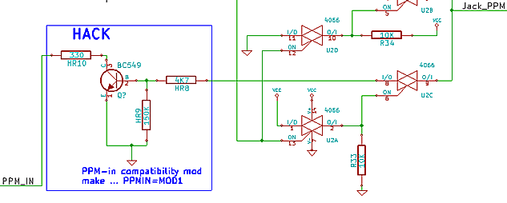

# This project has been superseded by [opentx](http://opentx.googlecode.com/) #

The following data is likely obsolete, kept here for mostly just for historical record.

# PPM-in Compatibility (Hack) #
**Relates to [Issue 15](https://code.google.com/p/gruvin9x/issues/detail?id=15)**

While working on various problems with PPM-in (aka. trainer/trainee) system, I discovered that Spektrum branded radios do not supply a signal capable of being used by the stock '9X radio's electronics.

Spektrum (and I presume JR? And Futaba?) output their PPM signal (via the phono jack on the back) as an approx. 1.5V peak-to-peak signal, which is also capacitively decoupled.

This scheme actually makes sense to me because it, a) prevents potential damage if the lead is somehow shorted out and, b) is much less likely to in any way inadvertently load or 'spike' the host or slave device in a way that could crash the CPU.

I have no idea what the Futaba/JR/Hi-tech scheme for this is, but I do have two Spektrum radios and I wanted them to be usable as trainer/trainee slaves with my Turnigy '9X. So, out came the soldering iron, once again.

I broke the track leading from the 4066 quad-switch chip (pin 8) and into PE7 on the ATmega, then inserted an NPN buffer transistor -- essentially to 'amplify' the 1.5V signal back up to 5V-TTL for the ATmega. A side-effect of this that the signal gets inverted. (I could have used a PNP transistor to prevent the inversion, but that would have created other issues.) The inversion was easily fixed by changing a single binary bit in the program code. This is optional of course -- please see the notes for `PPMIN=` on the [Make Options](MakeOptions.md) wiki page.

> _As of this writing, this code change is only available in the `branches/frsky` development repository. But I'm sure it will make its way into the `trunk/` area quite soon._

Here is the additional circuitry, which has been tested to work well with two Spektrum and one '9X radio, thus far.

> _Resistor HR10 (330ohm is what I had on hand) proved important. Without it, the relatively high current sink from the transistor against the ATmega's internal pull-up was able to spike the ATmega's power supply sufficiently to cause the odd crash. I imagine the net resistance of the 4066 was sufficient 'spike' protection, before this mod. **shrug**_

# The Future (Custom PCB V3+) #

I will definitely include at least this mod in the V3 PCB (after the V2 prototype has had its potential bugs ironed out). I may go further to include a capacitive decoupling arrangement, and hopefully remove the need for the 4066 altogether.
