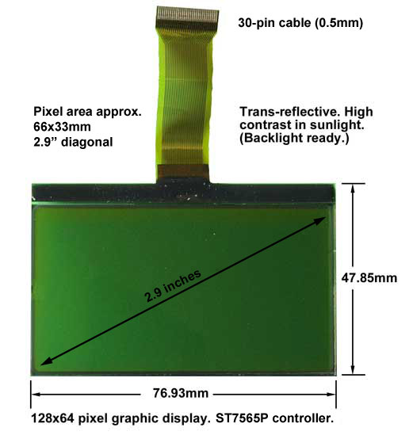

# Hardware Reference Images #

Here are some annotated photos of various '9X hardware components to assist with part identification, PCB replication, LCD replacement, etc.

Note: Some of the images are fairly high resolution on purpose.

## LCD Screen ##
We believe the following are the main specifications of this display ...
  * Dimensions:  77 x 48mm.
  * Pixel View Area: 66.52mm x 33.24mm -- 2.9" diagonal (0.48mm sq. pixels with 0.04mm gaps)
  * Front Polariser: Transmissive (Adhesive)
  * Back Polariser: Transflective (Adhesive)
  * Display Mode: FSTN
  * Viewing Angle: 90-degrees perpendicular (6:00 o'clock)
  * Controller IC: **ST7565P** (very common) -- "chip on glass" version
  * Operating Voltage: 3.3V (not 3.0V)
  * Connector: COG+FPC 30-pin, 0.5mm pitch
  * Manufacturer: Unknown
  * [Mechanical data sheet](ReferenceImages.attach/lcd-display-mechanical.pdf) for similar display,  [here](ReferenceImages.attach/lcd-display-mechanical.pdf). (Thanks [@devnow](https://code.google.com/u/100578513419733812290/).)

  * **Replacement part availability** ...
    * Try [eBay.com](http://www.ebay.com)
    * Or [www.BuyDisplay.com](http://www.buydisplay.com). I found nothing the same size with the same 30-pin connector, at BuyDisplay. But there is [this one](http://www.buydisplay.com/default/2-9-inch-cog-lcd-module-128x64-display-arduino-st7565p-white-on-black.html) at US$6.52, which is the right size and controller chip, but a 26 contact cable. :-/ There is also a smaller 2.1" display, which would fit in a '9X and does have the right 30-pin cable.
    * The [R2Hobbies](http://www.r2hobbies.com/eng/proddetail.php?prod=rcps2845001) supply of TH9X spare part displays has dried up.

- - -

I've not personally owned a V1 '9X, but apparently the V2 changed from a 5V LCD screen to a 3.3V version. An additional 3.3V regulator and a bunch of voltage-divider resistors are used to interface this to the 5V ATmega64A MCU.

## Connectors ##
See the PCB reference images for approx. dimensions. (Ignore the strange looking coil of wire to the middle-left. It's not part of the stock hardware.)

Japanese "JST" brand -- 2mm pitch (there's a larger version as well.) Quite common. 
 
<h2>Inside</h2>

Inside the front section of the cabinet (main PCB removed). 
 

<h2>Main PCB</h2>

My '9X is a Turnigy 9X from HobbyKing.com. This is the "V2" version. Note the additional 3.3V regulator (left of the 5V one) and bunch of resistors above the ATmega64A MCU for driving the 3.3V LCD screen. 
 
<h3>Top</h3>

NOTE: These images are fairly high resolution -- Right-Click, View Image (or Save as...) to see full size. WARNING: Perspective errors in the camera lens mean the reference lines are approximate only. 
 

<h3>Bottom</h3>

This is the bottom of my second unit (to match image above). 
 

I removed the LCD screen's foam packer on my original unit to reveal all the traces. (Hi-res.) 
 

<h3>PhotoShop Layered Originals</h3>

PhotoShop is one of, if not <i>the</i> most expensive pieces of software I've ever bought. But it's been worth every penny. 
 
Here are the layered originals of the top and bottom images above -- at double the resolution, too. (Approx. 22MB each.) 
 
 
<a href='ReferenceImages.attach/pcb-ref-top.psd'>pcb-ref-top.psd</a>

<a href='ReferenceImages.attach/pcb-ref-bottom.psd'>pcb-ref-bottom.psd</a>
